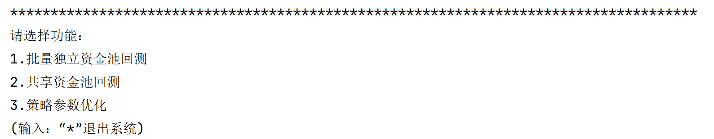
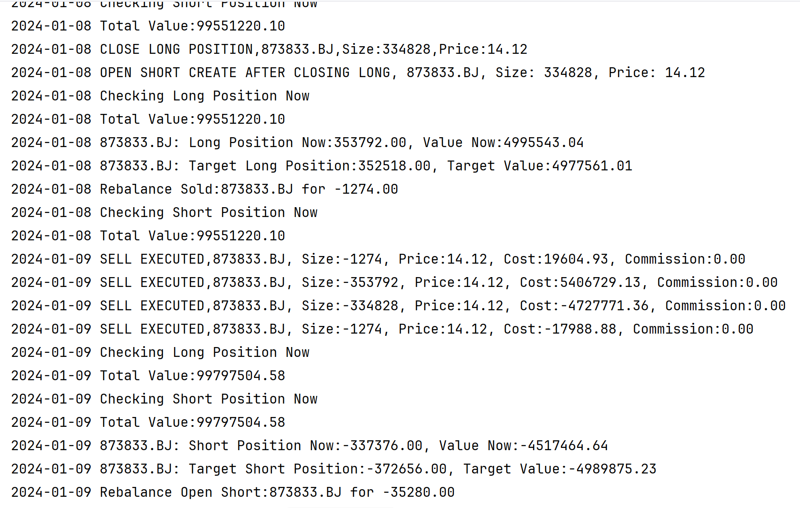

# Welcome to TL_BackTrader_Model

本项目是由桥之队开源的量化回测系统，主要用于股票与金融衍生品，如期货、期权、数字货币等品种的交易历史回测以及程序化交易。

当前进展（持续更新中）：

1.批量独立资金池策略，适用于每次交易只涉及一个品种的回测。

2.共享资金池回测，用于管理多个投资标的的买卖决策，通过多种技术指标来决定买卖时机。支持做多和做空操作；支持平衡持仓功能，在每个交易日结束时检查当前持仓的价值是否占总资产的5%（该占比可由使用者自行决定是否修改）。

3.策略参数优化，用于执行策略的参数优化流程，支持对不同策略（独立资金池、共享资金池）和回测模式进行优化。

## 下载项目

`git clone https://github.com/CabbageZhi/TL_BackTrader_Model.git`

## 环境准备

```
conda create -n BT_Model python=3.8

conda activbate BT_Model

pip install -r requirement.txt
```

## 运行

`python main.py`

我们已提供可供测试的股票列表，见codes.csv

## DEMO




## 编写约定

变量命名：类名采用驼峰式，单词首字母大写，不包含字符；类成员变量字母一般小写，函数一般大小写混合形式。

## TODO

本项目将持续更新新功能，如果对项目开发过程感兴趣，请与我们联系。
